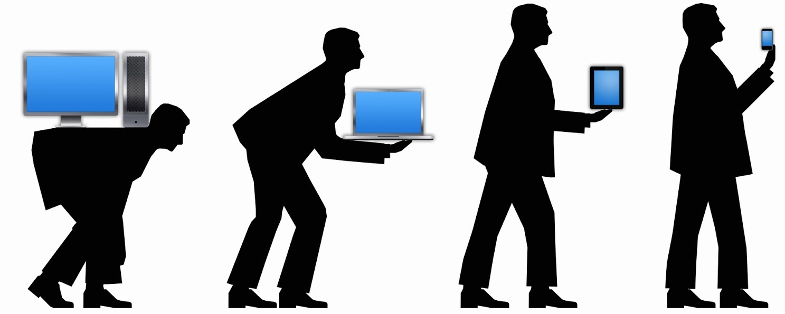
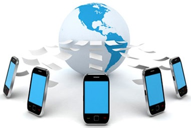

# Pôster Bônus

[Acess - PPT](https://github.com/rodrigocarlos2/P-sterB-nus/blob/master/poster-b%C3%B4nus.ppt)

* After open the link, click on Download to get the file.

# Tópicos

* Mobile Computing

Caracteriza-se  como uma tecnologia que permite a 
transmissão  de dados, voz e de vídeo através de um 
computador ou qualquer outro dispositivo sem que haja a necessidade  de uma ligação física e fixa. 

A Mobile Computing engloba dois conceitos principais que são: Hardware Móvel e Software Móvel. Hardware Móvel inclui dispositivos e ou componentes de um dispositivo que recebem serviços de portabilidade. Esses dispositivos podem ser laptops, smartphones, tablets e PC portáteis. 

O Software Móvel é o programa executado no Hardware Móvel. Eles podem ser Sistemas Operacionais como Android, Windows Mobile, IOS, entre outros.  

  

* Cloud Computing

  

* Mobile Cloud Computing

  

* Internet of Things

  

